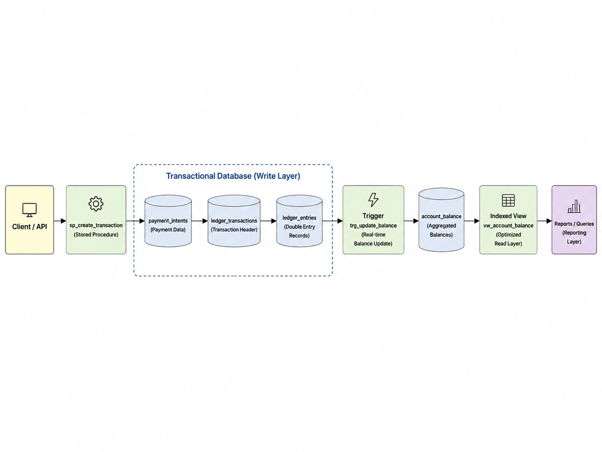
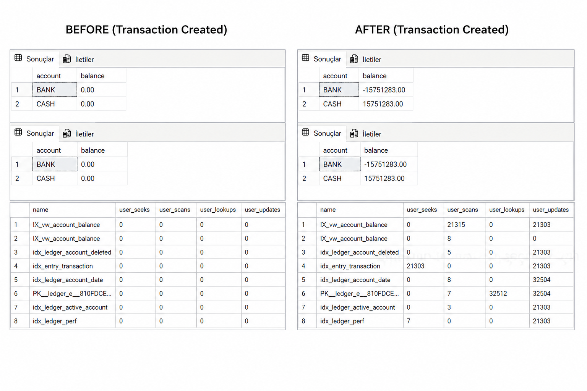

# 💳 LedgerShield

LedgerShield is a **database-first financial transaction system** built on SQL Server.

It enforces **financial correctness at the database layer** using:

* double-entry ledger
* strict constraints
* triggers
* idempotent operations

---

## 🚀 Features

* 💰 Double-entry accounting (debit = credit)
* 🔁 Idempotent transactions (duplicate-safe)
* ⚡ Real-time balance updates (trigger-based)
* 📊 Indexed view optimization (fast reads)
* 🧠 Strong consistency (SERIALIZABLE)
* 🏢 Multi-tenant ready

---

## 🧠 Architecture

* 📄 [Architecture Overview](docs/architecture.md)
* 📊 [Performance Report](docs/performance_report.md)

---

## 🖼️ System Flow



---

## 📊 Before / After (Balance Update)



---

## ⚙️ Setup

> ⚠️ This project uses **SQLCMD mode** (`:r` includes).
> You must run scripts using **sqlcmd**, NOT standard SSMS execution.

---

### 🔧 Step 1 — Initialize Database

Only the **V1 migration** is required to fully set up the system.

```bash id="cmd1"
sqlcmd -S . -d master -i database/migrations/V1__init.sql
```

This will automatically:

* Create database
* Create all tables
* Apply constraints
* Create indexes
* Create triggers
* Create stored procedures

---

### 🔁 Optional Migrations

Additional migrations can be applied if needed:

```text id="opt1"
V2  → idempotency
V3  → audit
V4  → soft delete
V5  → reporting
V6  → concurrency
V7  → rollback example
V8  → partitioning
V9  → performance indexing
```

---

## 🌱 Seed Data

Basic test data:

```bash id="cmd2"
sqlcmd -S . -d LedgerShieldDB -i database/seeds/seed_basic.sql
```

Heavy test data:

```bash id="cmd3"
sqlcmd -S . -d LedgerShieldDB -i database/seeds/seed_heavy.sql
```

---

## 🧪 Testing

### ⚡ Performance Test

```bash id="cmd4"
sqlcmd -S . -d LedgerShieldDB -i database/tests/performance/performance_test.sql
```

---

### 🧠 Execution Plan Analysis

```bash id="cmd5"
sqlcmd -S . -d LedgerShieldDB -i database/tests/performance/execution_plan_raw.sql
sqlcmd -S . -d LedgerShieldDB -i database/tests/performance/execution_plan_indexed_view.sql
```

---

### 🔍 Integrity Tests

```bash id="cmd6"
sqlcmd -S . -d LedgerShieldDB -i database/tests/integrity/ledger_integrity_test.sql
sqlcmd -S . -d LedgerShieldDB -i database/tests/integrity/balance_consistency_test.sql
```

---

### 🔁 Concurrency Test

```bash id="cmd7"
sqlcmd -S . -d LedgerShieldDB -i database/tests/concurrency/concurrency_test.sql
```

---

### 📦 Load Test

```bash id="cmd8"
sqlcmd -S . -d LedgerShieldDB -i database/tests/load/load_test.sql
```

---

## 📁 Project Structure

```text id="tree1"
database/
│
├── migrations/
├── schema/
│   ├── tables/
│   ├── constraints/
│   ├── indexes/
│   ├── views/
│   └── triggers/
│
├── procedures/
├── seeds/
├── setup/
└── tests/
    ├── performance/
    ├── integrity/
    ├── load/
    ├── concurrency/
    └── idempotency/

docs/
│
├── architecture.md
├── performance_report.md
├── diagrams/
└── _archive/
```

---

## 🧠 Core Concept

> Incorrect data cannot be written

LedgerShield enforces correctness through:

* database constraints
* transaction boundaries
* trigger-based validation

---

## 📌 Notes

* This is a **database-first system**
* No application layer is required
* All business rules are enforced in SQL Server
* Designed for **correctness over availability**

---

## 👨‍💻 Author

Mertcan Kayırıcı
