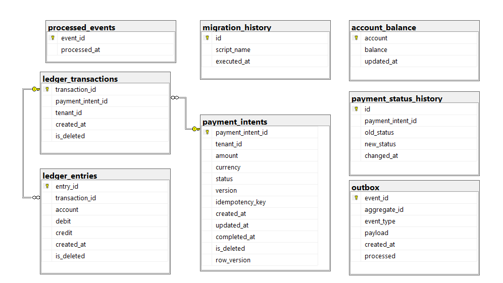

# 💳 LedgerShield
### **Database-First Financial Integrity System Built for Absolute Consistency**

<p align="center">
  
  
  
  
</p>

---

## 📌 Overview

**LedgerShield** is a **production-grade, database-first financial transaction engine** designed to guarantee **data correctness at the lowest level — the database itself**.

Unlike traditional systems that rely on application logic, LedgerShield enforces **financial integrity directly within SQL Server** using:

- deterministic constraints  
- transactional guarantees  
- trigger-based validations  
- idempotent operations  

> 💡 _If data is incorrect, it simply cannot exist._

---

## 🚀 Features

- 💰 **Double-entry accounting system** (guaranteed debit = credit)
- 🔁 **Idempotent transaction processing** (duplicate-proof operations)
- ⚡ **Real-time balance updates via triggers**
- 📊 **Indexed views for high-performance reads**
- 🧠 **Strict isolation level (SERIALIZABLE)**
- 🏢 **Multi-tenant ready schema design**
- 🔒 **Database-enforced business rules**
- 🧪 **Built-in testing and validation scripts**

---

## 🧠 Architecture Highlights

- **Database-First Design** → No dependency on application layer  
- **ACID Compliance** → Every transaction is fully atomic  
- **Trigger-Based Enforcement** → Real-time validation & updates  
- **Idempotency Layer** → Safe retries without duplication  
- **Indexed Views** → Optimized read performance for balances  
- **Strict Constraints** → Impossible invalid state
  
---

## 🗺️ Database Schema

The system is built around a normalized, constraint-driven schema that enforces financial correctness at the database level.



---

## 🖥️ Demo

| Scenario                  | Description                              |
|--------------------------|------------------------------------------|
| Transaction Insert       | Debit/Credit enforced automatically      |
| Duplicate Request        | Ignored via idempotency logic            |
| Balance Query            | Instant via indexed view                 |
| Concurrent Execution     | Safe under SERIALIZABLE isolation        |

---

## 🖼️ Visuals

### 🔄 System Flow


### 📊 Balance Update (Before / After)


---

## 🧱 Tech Stack

- **Database**: SQL Server  
- **Language**: T-SQL  
- **Execution Tool**: sqlcmd  
- **Architecture Style**: Database-First  
- **Isolation Level**: SERIALIZABLE  

---

## ⚙️ Installation

> ⚠️ SQLCMD mode is required (`:r` includes are used)

### 1️⃣ Initialize Database

```bash
sqlcmd -S . -d master -i database/migrations/V1__init.sql
```
This automatically:

- Creates database
- Builds schema (tables, constraints, indexes)
- Registers triggers
- Deploys stored procedures

---

## 🗄️ Database Setup
Connection String Example
```
Server=localhost;
Database=LedgerShieldDB;
Trusted_Connection=True;
MultipleActiveResultSets=true;
```

---

## 🌱 Seed Data
Basic Dataset
```bash
sqlcmd -S . -d LedgerShieldDB -i database/seeds/seed_basic.sql
```
Heavy Dataset (Load Simulation)
```bash
sqlcmd -S . -d LedgerShieldDB -i database/seeds/seed_heavy.sql
```

---

## 🔐 Authentication & Security
- 🔒 Transaction-level consistency via SERIALIZABLE isolation
- 🧾 Idempotency keys prevent replay attacks
- 🧠 Business rules enforced via:
  * constraints
  * triggers
  * stored procedures
- 🚫 Invalid financial states are structurally impossible

---

## 🧩 Key Functionalities
### 💰 Double-Entry Ledger

Every transaction must satisfy:

- Total Debit = Total Credit
- Otherwise → rejected at DB level
  
### 🔁 Idempotent Transactions
- Unique request keys
- Safe retries
- No duplication risk

### ⚡ Real-Time Balance Calculation
- Trigger-driven updates
- Indexed view acceleration
- No stale reads

### 🧪 Built-in Testing Suite
Performance Test
```bash
sqlcmd -S . -d LedgerShieldDB -i database/tests/performance/performance_test.sql
```
Execution Plan Analysis
```bash
sqlcmd -S . -d LedgerShieldDB -i database/tests/performance/execution_plan_raw.sql
sqlcmd -S . -d LedgerShieldDB -i database/tests/performance/execution_plan_indexed_view.sql
```
Integrity Validation
```bash
sqlcmd -S . -d LedgerShieldDB -i database/tests/integrity/ledger_integrity_test.sql
sqlcmd -S . -d LedgerShieldDB -i database/tests/integrity/balance_consistency_test.sql
```
Concurrency Test
```bash
sqlcmd -S . -d LedgerShieldDB -i database/tests/concurrency/concurrency_test.sql
```
Load Test
```bash
sqlcmd -S . -d LedgerShieldDB -i database/tests/load/load_test.sql
```

### 📁 Project Structure
```
database/
│
├── migrations/
├── schema/
│   ├── tables/
│   ├── constraints/
│   ├── indexes/
│   ├── views/
│   └── triggers/
│
├── procedures/
├── seeds/
├── setup/
└── tests/
    ├── performance/
    ├── integrity/
    ├── load/
    ├── concurrency/
    └── idempotency/

docs/
│
├── architecture.md
├── performance_report.md
├── diagrams/
└── _archive/
```

---

## 🔮 Future Improvements
- 📡 REST API layer (optional integration)
- 📊 Real-time analytics dashboard
- 🧾 Audit log visualization tools
- ⚙️ Automated migration runner
- ☁️ Cloud-native deployment (Azure SQL / AWS RDS)
- 🔐 Row-level security enhancements

---

## 📜 License

This project is licensed under the MIT License.

---

## 👨‍💻 Author

Mertcan Kayırıcı
